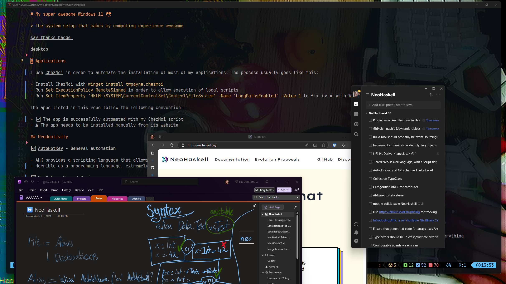
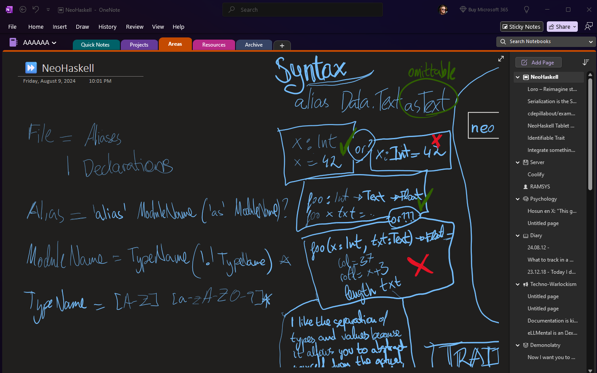

# My super awesome Windows 11 😎

> Enter my digital temple, where I weave my aetherial creations.

[](https://ko-fi.com/nickseagull)



# Applications

I use [ChezMoi](https://chezmoi.io/) in order to automate the installation of most of my applications. The process usually goes like this:

- Install ChezMoi with `winget install twpayne.chezmoi`
- Run `Set-ExecutionPolicy RemoteSigned` in order to allow execution of local scripts
- Run `Set-ItemProperty 'HKLM:\SYSTEM\CurrentControlSet\Control\FileSystem' -Name 'LongPathsEnabled' -Value 1` to fix issue with Windows long paths.
- Initialize ChezMoi using this repo.

The apps listed in this repo follow the following convention:

- ✅ The app is successfully automated with my ChezMoi script
- ⚠ The app needs to be installed manually from its website

You can get a more updated list of apps that I use in the [packages file](.chezmoidata/packages.yaml).

## Productivity

**✅ [AutoHotKey](https://www.autohotkey.com/) - General automation**

- AHK provides a scripting language that allows you to automate most of the things in Windows. From remapping keys, to moving the mouse, you can automate everything.
- Horrible as a programming language, extremely great as a tool.

**✅ [OneNote](https://www.onenote.com/) - Second Brain**

- I use it as my second brain where I just dump all my thoughts, ideas, half baked projects, etc...
- The main reason for using it is that it works very well with my eInk tablet, Boox Tab Ultra C, for handwriting notes, and it supports OCR of my handwriting.
- I use the PARA method for organizing my notes.



**✅ [BitWarden](https://bitwarden.com/) - Password management**

- Having the same password for all the sites is a very bad practice. I learnt this once a friend's Steam account got hacked, and with it, his email, Facebook, and everything.
- Thanks to passwords managers like this one, I don't even need to remember my passwords.

**✅ [Espanso](https://espanso.org/) - Text expansions**

* I try to avoid typing the typical stuff, like my name, address, etc... Espanso helps me with this task
* Also, I don't like using acronyms, so I can automatically expand them.
* You can find the expansions [here](AppData/Roaming/espanso/config/default.yml)

**✅ [Link Shell Extension](http://schinagl.priv.at/nt/hardlinkshellext/linkshellextension.html#contact) - Context menu entry to create symlinks**

- Sometimes it is useful to create a symbolic link from a folder/file to another place. This is specially useful when dealing with configuration files that are checked in a version control system like Git.


**⚠️ [Minibin](https://www.majorgeeks.com/files/details/minibin.html)**

- I like keeping my desktop clean, with no visible icons. So having the recycle bin available in the system tray is very useful.

## Coding

**✅ [NeoVim](https://neovim.io/)** - My main code editor

* I use [LazyVim](https://www.lazyvim.org/) as the configuration framework, it is a great foundation for building my config on top of it, without spending days on figuring out the missing stuff.

**✅ [Visual Studio Code](https://code.visualstudio.com/) - Secondary code editor**

* It is one of the most used text editors, so I always keep it nearby, especially when ensuring correct developer experience in [NeoHaskell](https://neohaskell.org)

**✅ [Alacritty](https://alacritty.org/) - Terminal emulator**

**✅ [Windows Subsystem for Linux 2](https://learn.microsoft.com/en-us/windows/wsl/install) - Run Linux apps natively on Windows**

* WSL allows running Linux apps on Windows, interoperating with your current files, etc... So it is a much better experience than a Virtual Box, or alike.
* Might give some problems in terms of installing the kernel update package, just follow the steps shown in the terminal.
* If you had bad experiences with WSL in the past, but you haven't tried the version 2, I highly recommend that you try it now. They fixed most of the issues.


## Social

**✅ Discord - Chat**

* Most of the communities I'm in use Discord. Either the [NeoHaskell](https://neohaskell.org) one, my server with friends, etc...

**✅ [Telegram](https://telegram.org)**

**✅ [WhatsApp](https://whatsapp.com)**

## Music

**✅ [YouTube Music Desktop App](https://th-ch.github.io/youtube-music/) - Music player**

* An open-source app with loads of integrations like OBS. I use YouTube Music and not Spotify. This is a surprise for most people, but mainly it is because I prefer to pay for a single service, and with that I don't get ads on YouTube on my mobile phone.

## Multimedia

**✅ OBS - Recording and Streaming**

* Great app for screen sharing and recording, really customizable.
* I use the following plugins:
  * [Retro Effects](https://github.com/FiniteSingularity/obs-retro-effects)
  * [DroidCam](https://github.com/dev47apps/droidcam-obs-plugin) - This one lets me use an old phone as a camera
  * [Tuna](https://github.com/univrsal/tuna/) - To display the song that is pl.

**⚠️ [DaVinci Resolve 19](https://www.blackmagicdesign.com/es/products/davinciresolve/)**

* My main video editor. It is free, and one of the greatest video editing software. Used by studios like Marvel.
* Can look overwhelming at first, but by checking some tutorials, you get the tasks done very easily.

**⚠️ [Ableton Live 12 Lite](https://www.ableton.com/en/products/live-lite/)**

* Main digital audio workstation. It came with my [Launchpad X](https://novationmusic.com/products/launchpad-x), and it gives me more than enough features to make my music.


## Internet

**✅ [Microsoft Edge](https://www.microsoft.com/edge)**

* It just works, comes with Windows, I can sync my bookmarks across all my devices, and the AI-based tab grouping feature is great

**⚠️ [Min Browser](https://minbrowser.org/)**

* A minimalistic browser that I use for recording my videos. The distraction-free interface helps to focus my content on what I'm looking at.


**✅ [Transmission]( https://transmissionbt.com/ ) - Torrent client**

* I use this client to share files from time to time, very minimal one, which I like.

## Command Line Apps

I use most of my command line apps from WSL, apart from a few ones described here:

### WSL CLI apps

**⚠ `nix` - A purely functional package manager**

* I install Nix by using the [Determinate Systems Nix Installer](https://github.com/DeterminateSystems/nix-installer). Basically running the following command in WSL2.

```sh
    curl --proto '=https' --tlsv1.2 -sSf -L https://install.determinate.systems/nix | sh -s -- install
```

