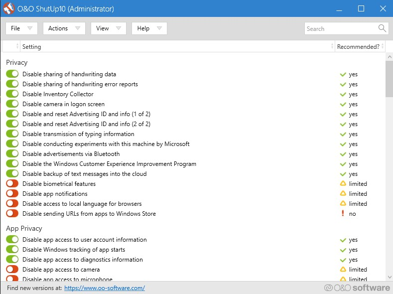
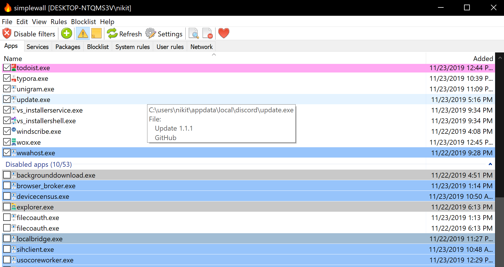
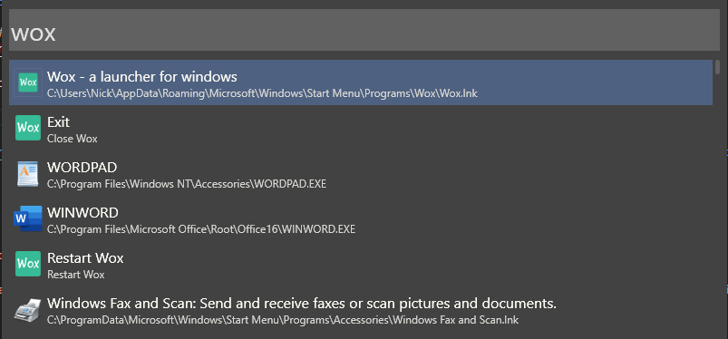
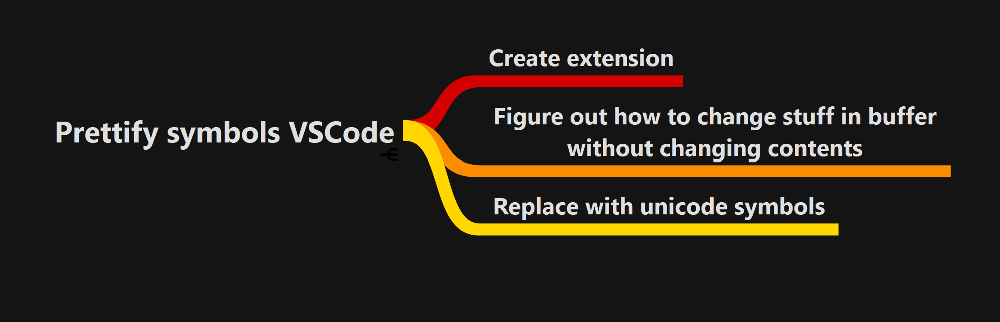
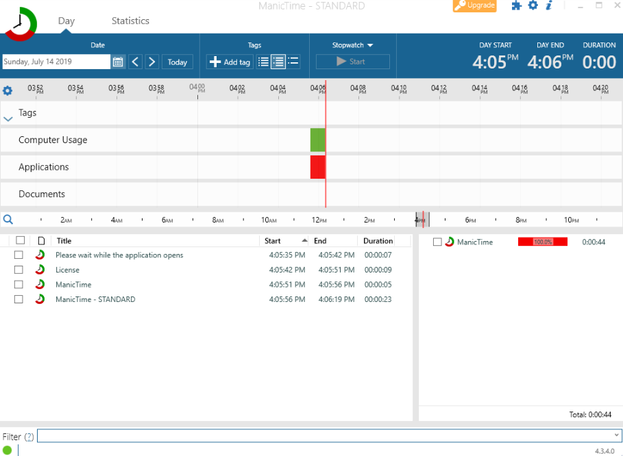
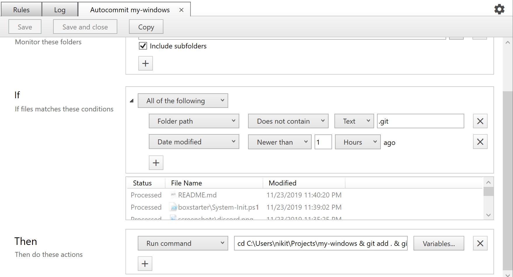
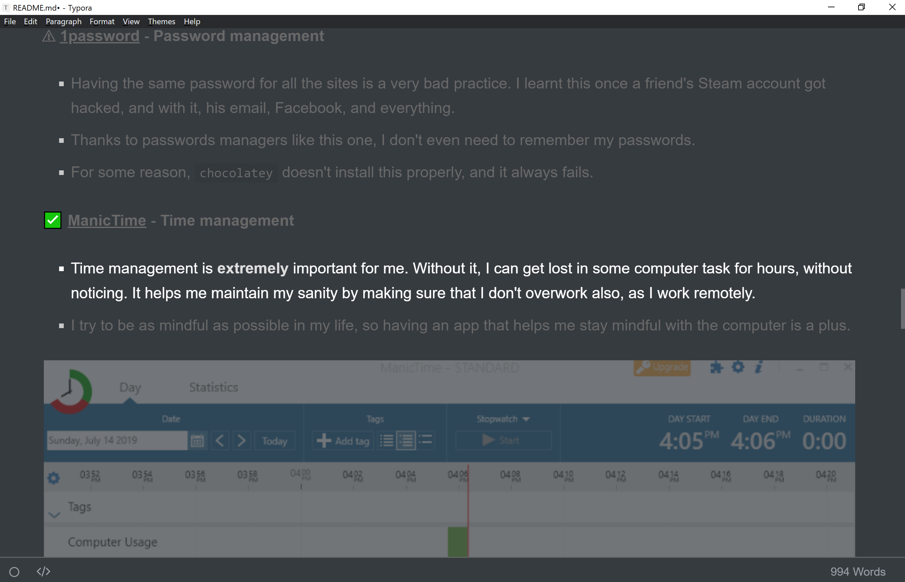
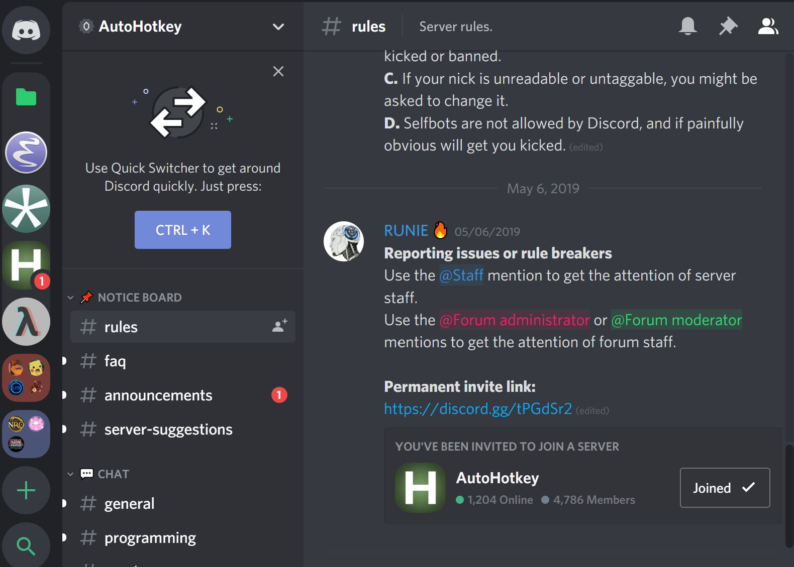

# My super awesome Windows 10 🐱‍🐉

> The system setup that makes my computing experience awesome

# Applications

I use [BoxStarter](https://boxstarter.org/) in order to automate the installation of most of my applications. The process usually goes like this:

- Install BoxStarter with `. { iwr -useb https://boxstarter.org/bootstrapper.ps1 } | iex; Get-Boxstarter -Force`
- Run the BoxStarter script of this repo with `Install-BoxstarterPackage -PackageName https://raw.githubusercontent.com/NickSeagull/my-windows/master/boxstarter/System-Init.ps1 -DisableReboots`

The apps listed in this repo follow the following convention:

- ✅ The app is successfully automated with BoxStarter
- 👜 The app needs to be installed manually from the Windows store
- ⚠ The app needs to be installed manually from its website

## Security

**✅ [ShutUp10](https://www.oo-software.com/en/shutup10) - Privacy Issues fixer**

- Yes, Windows 10 still is far behind other OSes regarding privacy. Luckily ShutUp10 exists.
- ShutUp10 helps disabling all the harmful Windows privacy settings with just one click

**✅ [SimpleWall]( https://www.henrypp.org/product/simplewall) - Better Firewall**

* The Windows Firewall is nice, but it is not that accessible.
* SimpleWall begins by blocking all apps, and starts prompting you for out/incoming connections, so you can allow them, or leave them blocked.

**✅ [WindScribe]( https://windscribe.com/ ) - VPN**

* When connecting through public networks, I **always** use a VPN in order to protect myself.
* It also comes with some perks, like bypassing ports that are being blocked by the network.
* WindScribe has a nice app that I like to select different servers.

## Productivity

**✅ [AutoHotKey](https://www.autohotkey.com/) - General automation**

- AHK provides a scripting language that allows you to automate most of the things in Windows. From remapping keys, to moving the mouse, you can automate everything.
- I have used AHK extensively in the past and I even created bots for online games with it (yes, I was THAT guy, but not always). You can imagine the power of this tool now.

**✅ [Todoist](https://todoist.com/) - Todo lists**

- I use Todoist because it has a nice Android app that comes with a shortcut to add to inbox.
- I'm slowly getting used to GTD, so Todoist is a nice addition for my workflow.

**✅ [Wox](https://wox.one) - Application Launcher**

* When I tried Mac for some years, I fell in love with the [Alfred app]( https://www.alfredapp.com/ ). Wox brings a similar experience to Windows, plus it's open source.

**✅ [Notion](https://www.notion.so/) - All organizer**

- Notion is a software masterpiece, it makes organization seem very simple
- Replaces a lot of tools like Evernote, Google Sheets, etc..
- I use it mainly to organize my personal stuff

**⚠ [1password](https://1password.com/) - Password management**

- Having the same password for all the sites is a very bad practice. I learnt this once a friend's Steam account got hacked, and with it, his email, Facebook, and everything.
- Thanks to passwords managers like this one, I don't even need to remember my passwords.
- For some reason, `chocolatey` doesn't install this properly, and it always fails.

**⚠ [Espanso](https://espanso.org/) - Text expansions**

* I try to avoid typing the typical stuff, like my name, address, etc... Espanso helps me with this task
* Also, I don't like using acronyms, so I can automatically expand them.
* You can find the expansions [here](espanso/default.yml)

**⚠ [Simple Mind]( https://simplemind.eu/ ) - Mind mapping**

* I use Simple Mind to brainstorm around how can I break down a problem into smaller ones

**✅ [ManicTime](https://www.manictime.com/) - Time management**

- Time management is **extremely** important for me. Without it, I can get lost in some computer task for hours, without noticing. It helps me maintain my sanity by making sure that I don't overwork also, as I work remotely.
- I try to be as mindful as possible in my life, so having an app that helps me stay mindful with the computer is a plus.

**⚠ [FileJuggler]( https://www.filejuggler.com/ ) - Automatic File Organization**

* I use this app to autocommit some of my repos (like this one)
* Also, I remove downloads that start with `t.` after one day, so my Downloads folder doesn't get cluttered.
* Fails to be installed with `chocolatey`

**✅ [Transmission]( https://transmissionbt.com/ ) - Torrent client**

* I use this client to share files from time to time, very minimal one, which I like.

## Coding

**✅ [Visual Studio Code](https://code.visualstudio.com/) - My main code editor**

**✅ [Microsoft Terminal](https://www.microsoft.com/store/productId/9N0DX20HK701) - Terminal emulator**

👜 [Windows Subsystem for Linux](https://docs.microsoft.com/en-us/windows/wsl/install-win10) - Run Linux apps natively on Windows**

* Not really an app, but it needs to be installed, so it goes on this list. The chocolatey package didn't work for me, so I have to install it manually.
* WSL allows running Linux apps on Windows, interoperating with your current files, etc... So it is a much better experience than a Virtual Box, or alike.

**✅ [Docker Desktop]( https://www.docker.com/products/docker-desktop ) - Containerization of apps**

## Writing

**✅ [Typora](https://typora.io) - Minimalist WYSIWYG-ish Markdown editor**

* I use it to edit purely-Markdown repos/files, like this one.
* Love the focus mode, and the auto-rendering of the markdown, including images

## Social

**✅ [Slack](https://slack.com) - Work chat**

- I use Slack mainly for work, although I also chat from time to time in the Functional Programming one

**✅ Discord - Leisure chat**

* I like playing online games, and from time to time, I socialize in them, meaning that I have to talk to people, so I use Discord
* On the other hand, it also allows me to talk with people from some developer communities, like AutoHotKey.

**👜 [Unigram](https://github.com/UnigramDev/Unigram) - A Telegram client optimized for Windows 10**

- The regular Telegram client has some issues with DPI scaling, meaning that if I move the window from my 1080p monitor to the Surface one, it'll stay with the same resolution. This doesn't happen with Unigram, and I get integrated notifications.

## Music

**✅ [Spotify](https://spotify.com) - Music player**

* I use Spotify on a daily basis. I love listening to many kinds of music, and specially, discovering new songs.

## Web browsing

**✅ [Microsoft Edge Insider]( https://www.microsoftedgeinsider.com/en-us/ )**

- Edge Insider is a Chrome-compatible alternative. It is owned by Microsoft, meaning that it is (will be?, it is currently beta) optimized for Surface devices, and compatible with all the Chrome addons.

### Edge Insider extensions

**[Vimium](https://vimium.github.io/)**

**[1password](https://chrome.google.com/webstore/detail/1password-extension-deskt/aomjjhallfgjeglblehebfpbcfeobpgk)**

**[uBlock Origin]( https://chrome.google.com/webstore/detail/ublock-origin/cjpalhdlnbpafiamejdnhcphjbkeiagm )**

## Command Line Apps

**✅ [`chocolatey`]( https://chocolatey.org/ ) - An `apt`/`brew` for Windows**

**✅ [`bat`](https://github.com/sharkdp/bat) - A cat(1) clone with wings**

**✅ [`watchexec`](https://github.com/watchexec/watchexec) - Executes commands in response to file modifications**

**✅ [RunInBash]( https://github.com/neosmart/RunInBash ) - Aliases `$` to run any command in WSL**

## Operating System Extensions

**✅ [Link Shell Extension](http://schinagl.priv.at/nt/hardlinkshellext/linkshellextension.html#contact) - Context menu entry to create symlinks**

- Sometimes it is useful to create a symbolic link from a folder/file to another place. This is specially useful when dealing with configuration files that are checked in a version control system like Git.

# Acknowledgements

Thanks to [Nikita Voloboev]( https://nikitavoloboev.xyz/ ) for his awesome [`my-mac-os` list]( https://github.com/nikitavoloboev/my-mac-os ), without it, this one wouldn't exist 🙏

# Preferences

## Set DNS to DNS.Watch

- Docker has issues with the default DNS provided with Windows 10, to set it to DNS.Watch's servers, [follow this guide](https://dns.watch/how-to-windows-7).
