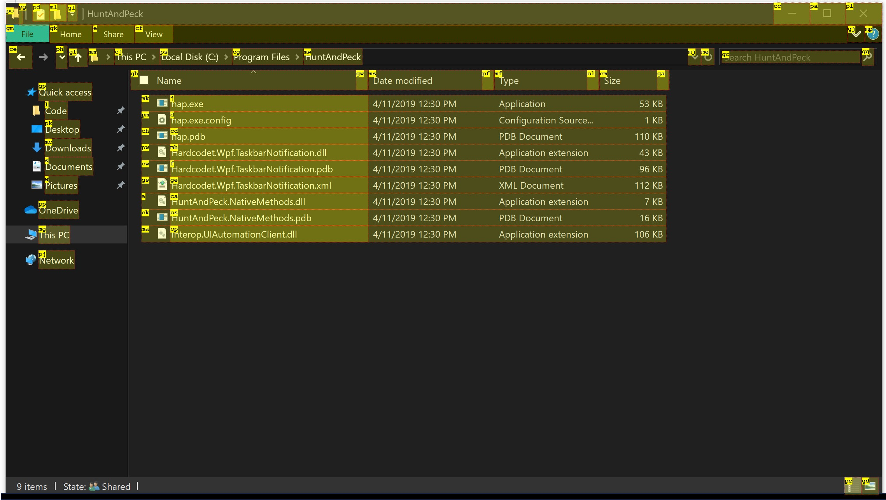
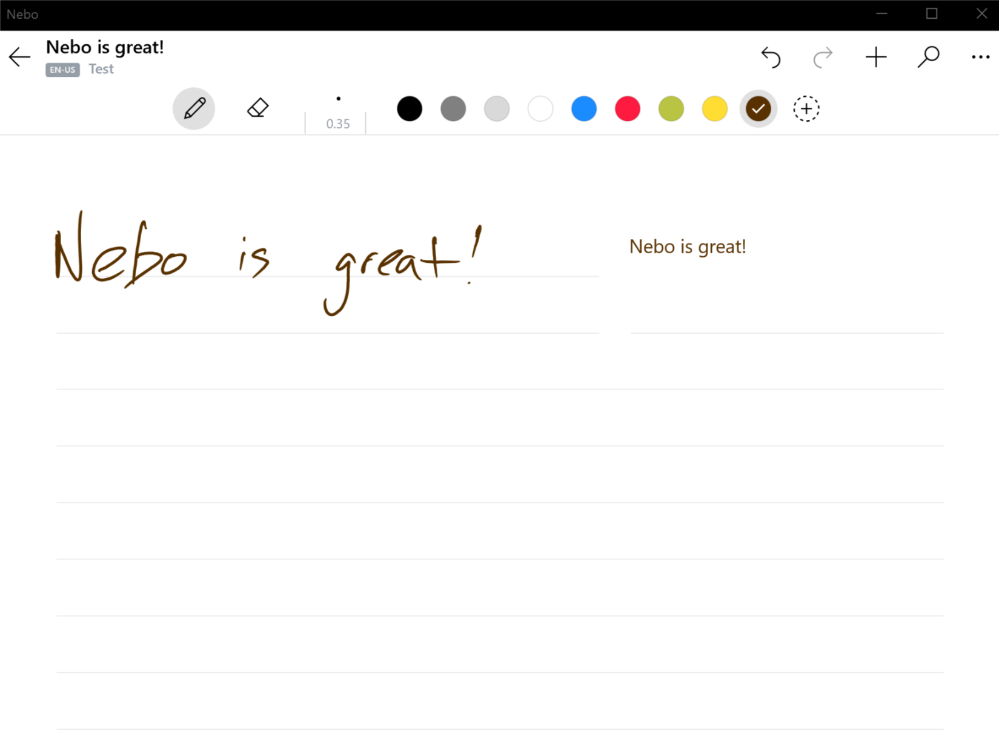

# My super awesome Windows 10

> _Desktop: Photo by [Irina Iriser](https://www.pexels.com/@iriser?utm_content=attributionCopyText&utm_medium=referral&utm_source=pexels) from [Pexels](https://www.pexels.com/)_

# Applications

## Productivity

**[Wox](http://www.wox.one/) - Launcher**

> _Note: I use [a fork](https://github.com/liberize/Wox/releases) by the user **liberize**. This fork allows launching Wox with a query already set. This, in combination with [AutoHotKey](#autohotkey), makes the automation of searches very easy._

> _Note: For Wox to work, we have to also download the [**Everything** search engine](https://www.voidtools.com/).

* I've been using Alfred for MacOS in the past, and while Wox is not that strong in terms of community and existing plugins, it is equally capable of doing the same stuff as Alfred does.

* Although C#, and Python are the languages that provide libraries for developing the Wox plugins, one can do so in any language you want, as long as it can be compiled to an executable, [according to the docs](http://doc.wox.one/en/plugin/create_plugin.html).

**[AutoHotKey](https://www.autohotkey.com/) - General automation**

* AHK provides a scripting language that allows you to automate most of the things in Windows. From remapping keys, to moving the mouse, you can automate everything.
* I have used AHK extensively in the past and I even created bots for online games with it (yes, I was THAT guy, but not always). You can imagine the power of this tool now.
* You can define also text expansions, so you don't repeat yourself everywhere. [This article](http://www.thenickmay.com/articles/how-to-expand-text-for-free-with-autohotkey/) is super useful on that.

**[HuntAndPeck](https://github.com/zsims/hunt-and-peck) - Vim-like Windows navigation**

* I'm a huge fan of Vim navigation, I use **Trydactyl** with Firefox to navigate easily the internetz. HuntAndPeck allows you to do the same, but in regular Windows apps (doesn't work in Modern Windows apps sadly).
* Press `ALT + ;` and a overlay will appear over the elements in your screen, allowing complete, and fast window navigation.

**[Todoist](https://todoist.com/) - Todo lists**

* I use Todoist because it has a nice Android app that comes with a shortcut to add to inbox.
* I'm slowly getting used to GTD, and from my point of view, Todoist has everything I need in the free tier (at least for now). Also it has a nice [Python library](https://github.com/Doist/todoist-python), so someday I can write a Wox plugin with it 😄

**[1password](https://1password.com/) - Password management**

* Having the same password for all the sites is a very bad practice. I learn't this once a friend's Steam account got hacked, and with it, his email, Facebook, and everything.
* Thanks to passwords managers like this one, I don't even need to remember my passwords.

**[ManicTime](https://www.manictime.com/) - Time management**

* Time management is **extremely** important for me. Without it, I can get lost in some computer task for hours, without noticing. It helps me maintain my sanity by making sure that I don't overwork also, as I work remotely.

* I try to be as mindful as possible in my life, so having an app that helps me stay mindful with the computer is a plus.

**[Nebo](https://www.nebo.app/) - Note taking**

* I **LOVE** handwriting, [it helps me learn faster](https://redbooth.com/blog/handwriting-and-memory), and doodle my ideas around.
* The issue with this, is that handwriting is not very shareable, and when taking notes on meetings, it is complicated to share handwritten notes, as one has to transcribe them and turn them into a document.
* Nebo does this for you _automagically_ by double tapping on your handwritten notes, as it will automatically convert this into text, and/or diagrams.

**[Screen Sketch](https://www.microsoft.com/en-us/p/screen-sketch/9mz95kl8mr0l?activetab=pivot:overviewtab) - Screenshot tool**

## Coding

**[Visual Studio Code](https://code.visualstudio.com/) - My main code editor**

**[Microsoft Terminal](https://www.microsoft.com/store/productId/9N0DX20HK701) - Terminal emulator**

**[Windows Subsystem for Linux](https://docs.microsoft.com/en-us/windows/wsl/install-win10) - Run Linux apps natively on Windows**

**[WSLGit](https://github.com/andy-5/wslgit) - Link WSL's Git and Windows one**

* I place this in `My Documents/Binaries` (which is added to my `PATH`) to allow VSCode to use `git` from WSL, instead of looking it in Windows itself.

## Web browsing

**[Firefox](https://www.mozilla.org/en-US/firefox/new/?redirect_source=getfirefox-com)**

* I use Firefox for my day-to-day web browsing. The fact that it is open is what makes me use it. I don't like the idea of monopolyzing software.

### Firefox extensions

**[Multi-touch Zoom](https://addons.mozilla.org/en-GB/firefox/addon/multi-touch-zoom/) - Smooth zooming**

* I have a Surface Pro 6 as my daily driver, so I like using it's tablet mode from time to time to browse. The fact that Firefox doesn't support pinch zooming out of the box is a bit frustrating. This extensions solves that 😁

## Command Line Apps

**[`bat`](https://github.com/sharkdp/bat) - A cat(1) clone with wings**

## Operating System Extensions

**[Link Shell Extension](http://schinagl.priv.at/nt/hardlinkshellext/linkshellextension.html#contact) - Context menu entry to create symlinks**

* Sometimes it is useful to create a symbolic link from a folder/file to another place. This is specially useful when dealing with configuration files that are checked in a version control system like Git.
* I use it to manage [my Wox plugins](https://github.com/NickSeagull/wox-plugins).

# Preferences

## Set DNS to Google

* Docker has issues with the default DNS provided with Windows 10, to set it to Google's DNS, [follow step 2 of this guide](https://www.cactusvpn.com/tutorials/how-to-set-up-smart-dns-on-windows-10/).
